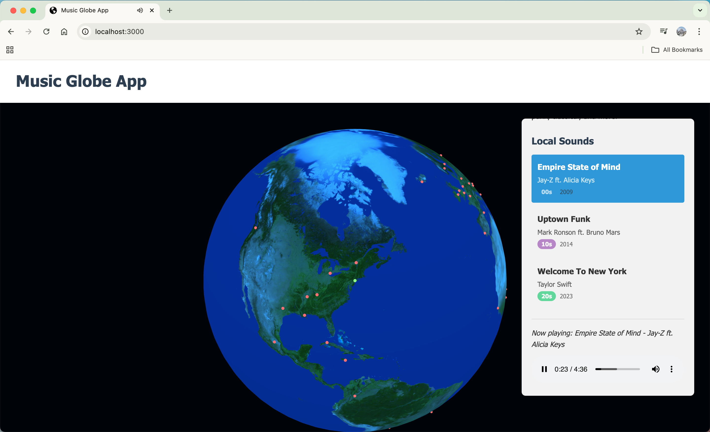

# Music Globe App

Music Globe App is an interactive 3D globe that allows users to discover music from cities around the world. Each marker reresents a city, and it contains a curated playlist that reflects its unique musical culture. Only songs from New York City's playlist are added and available to play.



## Features

- **Interactive 3D Globe**: Navigate the world by dragging to rotate and scrolling to zoom
- **Global Music Discovery**: Explore curated playlists from cities across different continents
- **Music Categories**: Tracks are categorized by decade to offer a diverse listening experience
- **Custom Music Player**: A seamless listening experience with a dedicated music player for each city
- **Responsive Design**: Works on both desktop and mobile devices

## Technology Stack

- **JavaScript**: Core application logic with a modular, component-based architecture
- **Three.js**: Powers the 3D globe visualization and interaction
- **HTML Audio API**: Music playback functionality
- **CSS**: Styling and animations

## How to Use

1. **Navigate the Globe**:
   - **Rotate**: Click and drag to rotate the globe
   - **Zoom**: Use the mouse wheel to zoom in and out
   - **Interact with markers**: Hover over and click markers representing cities

2. **Explore City Music**:
   - Click on any city marker to open its music player
   - Browse through the curated selection of tracks
   - Click on a track to play it
   - Close the player to return to globe exploration

## Getting Started

### Prerequisites

- A modern web browser with WebGL support (Chrome, Firefox, Safari, Edge)
- A local web server for development (if running locally)

### Running Locally

1. Clone repository and cd into it:
```bash
cd Music-Globe-App
```

2. Install dependencies:

```bash
npm install
```

3. Run development mode:

```bash
npm run dev
```

4. Open your browser and go to:

```bash
http://localhost:3000
http://192.168.1.235:3000 
```

## Future Plans

- Search functionality for finding cities by name
- Music filtering by genre, decade, or mood
- User accounts to save favorite cities and tracks
- Social sharing features
